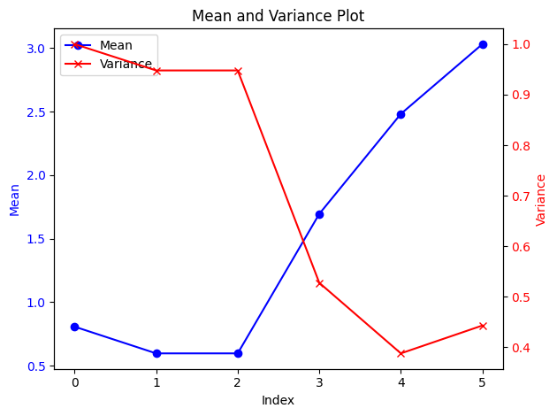

# Chew-C


<!-- WARNING: THIS FILE WAS AUTOGENERATED! DO NOT EDIT! -->

``` python
from chewc.core import *
```

In short, this will be a GPU-enabled stochastic simulation for breeding
programs with an emphasis on cost-benefit-analysis for novel breeding
tools and creating a suitable interface for RL agents.

------------------------------------------------------------------------

We will also incorporate an emphasis on budget and costs associated with
each action to manage long-term breeding budgets. As well as model
theoretical tools in the plant breeder’s toolbox. e.g.

> a treatment which increases crossover rates

> a treatment which reduces flowering time

> a treatment which enables gene drive at select loci

Each treatment will cost \$\$ ultimately helping guide the
implementation in real-world breeding programs.

## Install

``` sh
pip install chew-c
```

## How to use

First, define the genome of your crop

``` python
#boilerplate example
ploidy = 2
number_chromosomes = 10
loci_per_chromosome = 100
n_founders = 50
genetic_map = create_random_genetic_map(number_chromosomes,loci_per_chromosome)
crop_genome = Genome(ploidy, number_chromosomes, loci_per_chromosome, genetic_map)
founder_pop = create_random_founder_pop(crop_genome , n_founders)
```

``` python
qtl_map = select_qtl_loci(100,crop_genome)
add_fx = generate_marker_effects(qtl_map,founder_pop,0,1)
# Add a trait
trait_A = TraitA(
                qtl_map,
                add_fx,
                genome=crop_genome, 
                founder_pop=founder_pop, 
)
# Now you can use trait_A to calculate genetic values, simulate phenotypes, etc.
example_genotypes = create_random_founder_pop(crop_genome , 10)  # Example genotypes
genetic_values = trait_A.calculate_genetic_value(example_genotypes)
phenotypes = trait_A.setPheno(example_genotypes, h2=torch.tensor(0.5)) 
print(genetic_values)
print(phenotypes)
```

    tensor([4.9217, 3.0676, 3.8802, 3.4133, 3.8190, 2.0305, 1.8424, 3.8215, 2.8152,
            3.3127])
    tensor([5.3106, 2.9171, 3.4742, 3.4601, 3.0819, 3.1966, 2.1117, 3.8294, 2.2255,
            2.3835])

``` python
# recurrent truncation selection

means = []
variances = []

marker_fx = generate_marker_effects(qtl_map,founder_pop,0,1)

traita = TraitA(qtl_map, marker_fx,crop_genome, founder_pop)


tgv = traita.calculate_genetic_value(founder_pop)
means.append(tgv.mean())
variances.append(tgv.var())
                 
                 
years = 5

new_pop = random_crosses(founder_pop, len(founder_pop),genetic_map)
tgv = traita.calculate_genetic_value(new_pop)
means.append(tgv.mean())
variances.append(tgv.var())
                 
for i in range(years-1):
    tgv = traita.calculate_genetic_value(new_pop)
    truncate = truncate_select(tgv)
    new_pop = random_crosses(new_pop[truncate], len(new_pop),genetic_map)
    means.append(tgv.mean())
    variances.append(tgv.var())
```

``` python
# Create a figure and axis
fig, ax1 = plt.subplots()

# Plot means
ax1.plot(means, color='blue', marker='o', label='Mean')
ax1.set_xlabel('Index')
ax1.set_ylabel('Mean', color='blue')
ax1.tick_params(axis='y', labelcolor='blue')

# Create a second y-axis to plot variances
ax2 = ax1.twinx()
ax2.plot(variances, color='red', marker='x', label='Variance')
ax2.set_ylabel('Variance', color='red')
ax2.tick_params(axis='y', labelcolor='red')

# Add a title and show the plot
plt.title('Mean and Variance Plot')
fig.tight_layout()  # Adjust layout to prevent overlap

# Add legends
lines_1, labels_1 = ax1.get_legend_handles_labels()
lines_2, labels_2 = ax2.get_legend_handles_labels()
ax1.legend(lines_1 + lines_2, labels_1 + labels_2, loc='best')

plt.show()
```


